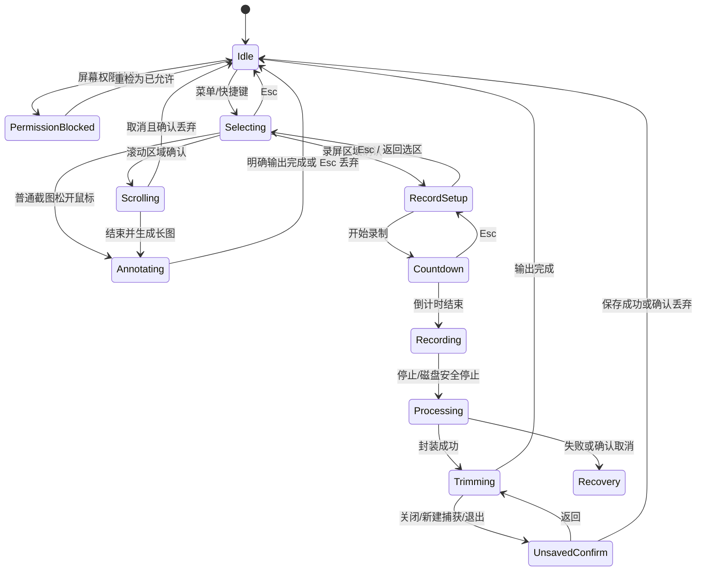

# ShotX MVP UX/UI 设计交付

版本：v1.4（对应 PRD v1.7 基线：标注工具栏固定工具区、工具选项浮层、可拖拽笔刷大小）
平台：macOS 14+，菜单栏应用  
需求来源：BRA-25、BRA-36；设计任务：BRA-26、BRA-39、BRA-53；交互修订：BRA-30、BRA-34、BRA-52
交付对象：macOS 客户端、QA

## 1. 设计边界与使用方式

本文是实现与验收依据；界面名称后的 ID 是开发、埋点错误码和 QA 用例共同引用的唯一标识。若本文与 PRD 冲突，以 PRD v1.7 为准。

- 覆盖全部 36 条有效 P0 `FR-*`（BASE-01~05、CAP-01~16、LONG-01~04、REC-01~12，其中 REC-03 已移除），不包含 P1。
- 不设计账号、云端、素材库、复杂时间线、打开图片或移动端。
- 应用默认无主窗口；捕获入口来自菜单栏或全局快捷键。
- 图片、视频、临时文件和恢复文件均只在本机处理。
- macOS 原生权限提示、保存面板、分享面板和 Finder 不做自绘替代。

## 2. 信息架构与界面清单

| ID | 界面/状态 | 形态 | 主要职责 |
| --- | --- | --- | --- |
| `W-ONB` | 首次启动 | 480 × 420 窗口 | 价值说明、进入权限设置 |
| `W-SET` | 设置 | 680 × 520 窗口 | 快捷键、截图、录屏、权限、恢复默认 |
| `M-BAR` | 菜单栏菜单 | 原生 `NSMenu` | 所有 P0 入口、最近结果、录制停止 |
| `O-SEL` | 全显示器选择层 | 每块显示器一个无边框浮层 | 区域、窗口、单显示器选择 |
| `O-ANN` | 截图就地标注 | 选择层内浮动工具栏 | 标注、调整选区、输出 |
| `O-LONG` | 滚动截图采集 | 选区 + 侧边预览板 | 开始、实时预览、暂停、保护阈值 |
| `O-RSET` | 录屏设置菜单 | 选区旁浮动面板 | 调整选区、声音、鼠标、原始尺寸、倒计时、开始录制 |
| `O-COUNT` | 倒计时 | 选区边界状态标签 | 3 秒倒计时与取消 |
| `O-REC` | 录制状态条 | 菜单栏下方浮动条 | 选区持续标识、时长、来源状态、警告、停止 |
| `W-PROC` | 录制收尾 | 520 × 240 窗口 | 封装进度、取消保护、失败恢复 |
| `W-TRIM` | 视频预览与首尾裁剪 | 960 × 680 窗口 | 播放、首尾裁剪、复制与保存 |
| `D-DISCARD` | 未保存确认 | 原生 sheet/alert | 保存、丢弃、返回 |
| `P-PIN` | 图片贴图 | 无标题置顶窗口 | 拖动、缩放、透明度、关闭 |
| `W-RECOVERY` | 异常恢复 | 560 × 320 窗口 | 恢复、在访达显示、丢弃 |
| `N-SAVE` | 保存/另存 | 原生 `NSSavePanel` | 选择路径、覆盖确认 |
| `N-SHARE` | 系统分享 | 原生 `NSSharingServicePicker` | 分享 PNG |

页面关系：

```text
首次启动 W-ONB → 权限 W-SET/权限 → 菜单栏就绪 M-BAR
                                  ├─ 截图 → O-SEL → O-ANN → 复制 / N-SAVE / N-SHARE / P-PIN
                                  ├─ 长截图 → O-SEL → O-LONG → O-ANN → 图片输出
                                  └─ 录屏 → O-SEL → O-RSET → O-COUNT → O-REC
                                                                    ↓ 停止
                                                               W-PROC → W-TRIM
                                                                         ├─ 复制
                                                                         ├─ N-SAVE
                                                                         └─ D-DISCARD
异常退出后再次启动 → W-RECOVERY
```

## 3. 核心状态机

### 3.1 捕获总状态



并发规则：进入 `Selecting` 后，其他捕获命令禁用；录制中仅“停止录制”“设置…”和“退出 ShotX”可用。退出录制中或存在未保存结果时必须先经过确认，不允许静默替换唯一副本。

### 3.2 最近结果状态

最近结果仅存在于当前 App 生命周期；新结果替换旧结果前，旧结果若未保存，先显示 `D-DISCARD`。

| 状态 | 菜单标题/可用动作 | 禁用动作 | 生命周期结束 |
| --- | --- | --- | --- |
| 无结果 | “最近一次结果”（整项禁用） | 全部 | — |
| 图片 | 复制、保存、贴图 | 在访达显示 | 新结果、明确丢弃、退出 |
| 未保存视频 | 复制、保存 | 贴图、在访达显示 | 保存后转“已保存视频”；或明确丢弃 |
| 已保存视频 | 复制、另存、在访达显示 | 贴图 | 新结果、退出；原文件不删除 |

保存失败或复制失败不改变最近结果状态，也不删除内存结果或恢复文件。

## 4. 首次启动、权限与设置

### 4.1 `W-ONB` 首次启动

布局从上到下：ShotX 图标（64）、标题“截屏与录屏，留在你的 Mac”、两行说明、隐私说明、主按钮“开始设置”、次按钮“稍后”。“稍后”关闭窗口并保留菜单栏；首次触发捕获仍进入权限检查。

主按钮进入 `W-SET/权限`，焦点落在“屏幕录制”行的主动作。不要在首次启动时主动请求麦克风权限。

### 4.2 `W-SET/权限`

权限列表固定三行：屏幕录制、系统音频、麦克风。每行包含图标、名称、用途、状态标签和一个上下文动作。

| 权限 | 未询问 | 已允许 | 已拒绝或受限 | 对主流程影响 |
| --- | --- | --- | --- | --- |
| 屏幕录制 | “需要授权” + “允许…” | “已允许” + “重新检测” | “不可用” + “打开系统设置” | 阻止所有截图、滚动截图和录屏 |
| 系统音频 | “使用时询问” | “已允许” | “不可用” + “打开系统设置” | 录屏设置中自动关，允许无系统声继续 |
| 麦克风 | “使用时询问” | “已允许” | “不可用” + “打开系统设置” | 录屏设置中自动关，允许无麦克风继续 |

规则：

- 屏幕权限可从权限页主动请求；其余两项只在用户于 `O-RSET` 首次打开对应来源时触发系统请求。
- macOS 将拒绝和受限都报告为不可用时，界面统一显示“不可用”，不猜测原因。
- 从系统设置返回前台、App 重启、点击“重新检测”时进入最长 2 秒的“正在检查…”状态；行内使用小型不确定进度指示器，动作暂时禁用。
- 检查完成后通过 VoiceOver 公告“屏幕录制已允许”或“屏幕录制仍不可用”，焦点返回触发重检的按钮。
- 系统要求重启 App 时显示：“更改将在重新打开 ShotX 后生效。”主按钮“退出并重新打开”；重启后恢复到原捕获模式入口，但不自动开始捕获。

精确文案：屏幕权限拦截提示为“ShotX 需要屏幕录制权限才能截取或录制屏幕。内容只在这台 Mac 上处理。”按钮“打开系统设置”“取消”。

### 4.3 `W-SET` 其余分区

左侧原生 sidebar：快捷键、截图、录屏、权限。窗口底部固定“恢复默认…”按钮。

| 分区 | 字段 | 规则/默认 |
| --- | --- | --- |
| 快捷键 | 区域截图、窗口截图、全屏截图、滚动截图、区域录屏、显示器录屏 | 使用原生快捷键录入框；保存前检查 ShotX 内部重复、macOS 已知保留组合和注册结果 |
| 截图 | 窗口阴影、默认完成动作 | 阴影开；完成动作“复制” |
| 标注样式 | 每个工具最近样式 | 各工具独立持久化，不提供全局样式覆盖 |
| 录屏 | 系统声音、麦克风、指针、点击反馈、倒计时 | 开、关、开、开、3 秒；输出固定为选区原始物理像素尺寸 |
| 保存 | 最近成功保存目录 | 只显示路径和“更改…”；首次为空 |

快捷键错误在字段下方内联显示，字段红色描边并保留旧值：

- 内部重复：“此快捷键已用于「区域截图」。”
- 已知系统保留：“此快捷键由 macOS 保留，请选择其他组合。”
- 注册失败：“无法注册此快捷键，可能已被其他应用使用。原快捷键未更改。”

“恢复默认…”打开确认 sheet：“恢复截图与录屏默认设置？”说明“不更改系统权限，不删除素材或最近结果。”确认后只重置 PRD 第 11.1 节列出的配置。

## 5. 菜单栏 `M-BAR`

使用模板图标，亮暗模式由系统着色。正常菜单顺序：

```text
区域截图                         ⇧⌘4（示例，展示用户配置）
窗口截图
全屏截图
滚动截图
────────────────
区域录屏
显示器录屏
────────────────
最近一次结果 ›                  （按状态显示子菜单）
────────────────
设置…                           ⌘,
退出 ShotX                      ⌘Q
```

状态变体：

- 屏幕权限缺失：图标右下有非纯色表达的叹号徽标；捕获命令仍可点击，点击后进入权限拦截而不是无反馈禁用。
- 选择/截图处理中：所有捕获命令禁用，显示“正在截取…”。
- 录制中：菜单首项为红色圆点 + “停止录制 00:12”；其他捕获命令禁用。
- 有恢复文件：顶部插入“有可恢复的录屏…”并打开 `W-RECOVERY`。

## 6. 全显示器选择层 `O-SEL`

### 6.1 共同行为

- 每个显示器覆盖一个无边框透明窗口；ShotX 自身所有浮层必须从捕获输出中排除。
- 指针所在显示器是当前目标：目标显示器遮罩黑色 28%，其他显示器 52%；状态不能只靠颜色，其他显示器中央显示“移到此处以选择这台显示器”。
- 区域选择限制在起点显示器内。拖到边界即截断，指针可继续跨屏但选区不跨越；释放后目标不自动切屏。
- 顶部中央模式标签显示“区域截图 / 窗口截图 / 全屏截图 / 滚动截图 / 区域录屏 / 显示器录屏”及“Esc 取消”。
- `Esc` 无副作用取消；`Tab` 在可聚焦目标间循环；`Return` 确认；所有模式都支持菜单/快捷键再次触发时先取消当前层。

### 6.2 区域状态 `O-SEL/region`

- 十字光标按下设起点，拖动形成选区；选区外遮罩，选区内原色。
- 选区边框 1 pt；四角 8 × 8 pt 把手、四边中点 6 × 6 pt 把手；点击热区至少 20 × 20 pt。
- 选区最小为 1 × 1 物理像素。创建后可拖动选区、拖边/角调整；方向键移动 1 物理像素，`Shift` + 方向键移动 10 物理像素。
- 尺寸标签显示最终导出的物理像素，如 `1280 × 720 px`。换算为 `round(pointSize × backingScaleFactor)`；不要向用户展示 point。
- 放大镜为 120 × 120 pt、8× 最近邻放大，显示中心十字和光标下 RGB/HEX；靠近边缘时自动翻转位置。

### 6.3 窗口状态 `O-SEL/window`

- 悬停窗口以 2 pt 强调描边，并显示应用图标、窗口标题和最终像素尺寸；标题最长一行，超出中间截断。
- `Tab/Shift+Tab` 按前后层级切换可见窗口，`Return` 捕获。
- 阴影开时预览描边包含阴影外边界，最终图片同边界；关闭时二者均不含阴影。被其他窗口遮挡不改变目标窗口完整捕获范围。
- 找不到可捕获窗口时显示“这里没有可截取的窗口”，并提供“切换到区域截图”。

### 6.4 单显示器状态 `O-SEL/display`

当前显示器出现 3 pt 高亮边框和名称“内建显示器 · 3024 × 1964 px”；点击或 `Return` 确认。全屏截图与显示器录屏都只捕获单台显示器。

## 7. 截图标注与图片输出 `O-ANN`

### 7.1 布局

拖拽松开仅建立选区并原位进入 `O-ANN`：不提交截图、不打开结果窗口。全显示器选择层继续存在，选区内容按屏幕原可视 point 尺寸 1:1 显示，选区外保持 28% 黑色遮罩；Retina 只改变捕获物理像素数，不放大画面。工具栏和八个调整把手同时保持可用，直到复制、保存、分享或贴图成功。

工具栏为**固定工具区（FR-CAP-14）**：高 40 pt、宽度在打开时一次计算并固定（`toolbarFixedSize`），元素集在任意工具、任意已选状态下不增不减、不隐藏、不替换；任何工具选项浮层展开/关闭都不改变工具栏本体尺寸与元素。工具栏默认置于选区下方 8 pt；与屏幕边缘、菜单栏或 Dock 冲突时依次翻到上方、选区内底部。若选区容不下工具栏，工具栏留在选区外并在当前显示器可用工作区内贴边，距边缘至少 8 pt；可用宽度不足时拆成“工具 / 输出”两行（两行合起来仍是同一固定元素集，不增删元素）。工具栏不得进入输出，也不得覆盖尺寸标签或当前拖动把手。

固定元素集（从左到右）：

1. 工具按钮行：选择、箭头、矩形、画笔、文字、马赛克、裁剪（7 个工具段，全部常驻）。
2. 编辑按钮：撤销、重做。
3. 样式入口：固定“样式”按钮（固定宽度，展示当前工具适用样式摘要：颜色色块 + 当前值，如“红 · 2 pt”；选择/裁剪工具下置灰显示“样式”）。点击展开/收起工具选项浮层（FR-CAP-15）。
4. 输出按钮行：复制（主按钮）、保存、分享、贴图、关闭。

工具栏行内**不再放置颜色或大小控件**：颜色、粗细、字号、笔刷大小一律在工具选项浮层中提供（FR-CAP-15/16），切换工具只切换浮层内容，不回填工具栏行内（替代旧 `updateStyleControls` 的隐藏/显示逻辑）。各工具只记忆自身最近样式：

| 工具 | 可选/移动/删除 | 样式 | 记忆范围 |
| --- | --- | --- | --- |
| 箭头 | 是 | 颜色、1/2/4/8 pt 粗细（可拖拽连续 1–8） | 仅箭头 |
| 矩形 | 是 | 颜色、1/2/4/8 pt 粗细（可拖拽连续 1–8） | 仅矩形 |
| 画笔 | 是 | 颜色、1/2/4/8 pt 粗细（可拖拽连续 1–8） | 仅画笔 |
| 文字 | 是 | 颜色、11/13/16/24/32 pt 字号（可拖拽连续 11–32） | 仅文字 |
| 马赛克 | 是 | 8/16/24/40 px 笔刷（可拖拽连续 8–40）；无颜色 | 仅马赛克 |
| 裁剪 | 否，不生成对象 | 无 | 不记忆 |

选择对象后：拖动移动；`Delete` 删除；方向键移动 1 px，`Shift` + 方向键 10 px；`Cmd+Z/Cmd+Shift+Z` 撤销/重做。撤销栈至少 20 步；裁剪、移动、样式更改和删除均各算一步。

文字编辑：双击对象进入编辑，`Esc` 结束编辑但保留文字；空文字失焦时删除对象。裁剪确认后保留落在新边界内的标注，对越界内容进行裁切，不自动移动对象。

鼠标命中优先级固定为：已展开菜单/浮层（含工具选项浮层）→ 工具栏 → 选区把手 20 × 20 pt 热区 → 标注对象 → 选区内容。无论当前标注工具为何，把手始终可拖动；“选择”工具下拖动选区空白处移动整个选区，其他工具下拖动空白处创建标注，按住 `Space` 拖动则临时移动选区。调整选区时已有标注保持相对屏幕坐标，越出新边界的部分仅在输出时裁切；调整和标注都写入同一撤销栈。选区小于 20 × 20 pt 时隐藏尺寸标签和工具栏但保留八个把手；放大到可容纳后恢复，仍可用键盘调整或按 `Esc` 退出。

初始键盘焦点保留在选区；`Tab/Shift+Tab` 按“选区 → 八个把手 → 工具栏（含固定“样式”按钮）→ 工具选项浮层（展开时）→ 输出按钮”循环。选区聚焦时方向键移动 1 物理像素、`Shift` + 方向键移动 10；把手聚焦时同样缩放。工具栏或尺寸标签因空间不足隐藏时，从焦点顺序移除；主按钮仅在自身聚焦时响应 `Return`。工具选项浮层打开时，`Esc` 先关闭浮层（见 §7.3.1），焦点返回“样式”按钮。

### 7.2 输出与反馈

- 主按钮始终是上一次成功完成动作；首次为“复制”。只有成功后才更新记忆。
- 复制：成功后显示 2 秒非模态 HUD“已复制到剪贴板”，关闭标注层并把图片设为最近结果；失败则层不关闭，显示“无法复制。请重试或保存图片。”
- 保存：使用 `N-SAVE`，固定 PNG；成功后 HUD“已保存”，最近目录更新；失败返回工具栏并显示“保存失败”，提供“重试”“另存为”。
- 分享：先生成最终 PNG 再打开 `N-SHARE`；用户取消分享不算失败且不关闭标注层。
- 贴图：生成已栅格化图片并打开 `P-PIN`，标注层关闭，图片成为最近结果。
- `Esc` 按“关闭菜单/浮层 → 结束文字编辑 → 取消当前未完成绘制 → 丢弃本次截图并退出”处理；最后一步不提交、不创建最近结果且不弹确认，已完成标注也一并丢弃。

马赛克在进入剪贴板、磁盘、分享或贴图前与底图合并；任何输出都不得包含可单独移除的底图层。

### 7.3 工具选项浮层与可拖拽笔刷大小（FR-CAP-15/16）

#### 7.3.1 工具选项浮层（FR-CAP-15）

点击带选项的工具（箭头/矩形/画笔/文字/马赛克）后，该工具的选项以 Dropdown / Popover 形式**向下**展开，出现在工具栏正下方固定位置。浮层是独立于工具栏的悬浮层：绝不改变工具栏尺寸、不挤占工具栏行内任何菜单项；关闭后工具栏恢复原样。

- 触发（FR-CAP-15）：点击带选项的工具（箭头/矩形/画笔/文字/马赛克）即选中工具并向下展开该工具选项浮层；点击固定“样式”按钮开合当前工具的选项浮层；再次点击当前已选带选项工具可收起浮层。切换工具时浮层内容原位切换到该工具选项，浮层位置不变。
- 锚点与避让（自上而下）：
  1. 默认：浮层顶边对齐工具栏底边 + 6 pt，水平方向与工具栏左边缘对齐（工具栏下方固定位置）。
  2. 工具栏下方空间不足（浮层底边超出显示器可用工作区或菜单栏遮挡区 < 8 pt）时翻转到工具栏上方（浮层底边 = 工具栏顶边 − 6 pt）。
  3. 上方也不足时，浮层在当前显示器可用工作区内贴边，距边缘至少 8 pt；仍放不下则浮层内部允许滚动。
  4. 浮层与选区、尺寸标签、当前拖动把手的碰撞：浮层不得遮挡正在拖动的把手；选区调整/把手拖动开始瞬间浮层自动关闭。
- 关闭：`Esc`（最高优先级，先于结束文字编辑）、点击浮层外任意处、选择/裁剪工具、点击主按钮执行输出。浮层关闭后工具栏尺寸与元素不变。
- 浮层属捕获排除层，不进入输出。

**浮层内容布局**（自上而下，宽 300 pt，`surface-float` 材质、`radius-md` 圆角、`shadow-float` 阴影；内边距 10 pt、组间距 8 pt）：

1. 记忆值回显行：当前工具名 + 当前值，如“箭头 · 颜色 红 · 2 pt”“文字 · 颜色 红 · 16 pt”“马赛克 · 16 px”，值随拖拽/选择实时更新。
2. 颜色区（箭头/矩形/画笔/文字）：12 个预设色块（2 行 × 6）+“取色器”按钮；色块选中态用 accent 描边 + 对勾，不只靠颜色。取色器锚点与行为沿用 FR-CAP-12（以点击时鼠标位置为左上角、可对屏幕真实像素取色）。
3. 尺寸区（全部带选项工具）：可拖拽笔刷大小组件（FR-CAP-16）+ 离散档位快捷按钮 + 当前值回显。马赛克只显示尺寸区（无颜色区）。

| 工具 | 颜色区 | 尺寸区范围 | 档位按钮 |
| --- | --- | --- | --- |
| 箭头 | 有 | 1–8 pt | 1/2/4/8 |
| 矩形 | 有 | 1–8 pt | 1/2/4/8 |
| 画笔 | 有 | 1–8 pt | 1/2/4/8 |
| 文字 | 有 | 11–32 pt | 11/13/16/24/32 |
| 马赛克 | 无 | 8–40 px | 8/16/24/40 |

#### 7.3.2 可拖拽笔刷大小组件（FR-CAP-16）

- 组件形态：水平 `NSSlider`（连续拖拽条），位于浮层尺寸区，为**默认入口**；离散档位作为快捷按钮并排于拖拽条旁，连续档与离散档并存。
- 拖拽交互：拖动滑块实时更新当前工具笔刷/字号/马赛克笔刷大小并即时反馈（正在绘制的预览同步变化）；松开（mouseUp）后把最终值提交为该工具记忆值并持久化（`annotationSizes[工具]`）。
- 档位按钮：点击档位立即把拖拽条吸附到该值、应用并持久化；再次打开浮层时拖拽条停留在最近记忆值。
- 默认值（首次使用/恢复默认）：箭头/矩形/画笔 2 pt、文字 16 pt、马赛克 16 px（沿用现有默认）。
- 记忆规则：各工具独立记忆，拖动过程中不落库、松开或点击档位才落库；与 FR-CAP-04“颜色和粗细记忆最近值”一致。
- 键盘：拖拽条聚焦时左右方向键调整 1 单位、`Shift` + 方向键调整 5 单位；`Return`/`Space` 在档位按钮上等价点击。
- VoiceOver：拖拽条标签“笔刷大小，当前 2，可调”，档位按钮“粗细 4 点”；值变化时按 §14.2 频率公告。

## 8. 贴图 `P-PIN`

本节依据 BRA-94 设计稿画板「pin 图样式参考」（`pin-design-BRA94.png`，2006×1000 px）重写。以下尺寸为画板像素采样值（基准：关闭按钮 ≈45 px ≈ 22 pt，画板按约 2x 绘制）；颜色均为画板实际像素。与既有 §8 语义差异以设计稿为准，详见 §8.7 兼容性。

### 8.1 控制条（出现/隐藏、布局与宽度）

- 鼠标 **hover 到 pin 图区域时渐出（0.2 s），移出后渐隐（0.2 s）**；其他时间隐藏。控制条与右上角关闭按钮同步显隐。
- 控制条在 pin 图组件内**水平居中摆放**（画板中两行整体水平居中于 pin 图）。
- 控制条宽度跟随 pin 图宽度自适应：`width = min(300, max(98, size.width - 60))`（最大 300、最小 98）。
- 结构：纵向两行，每行固定为 `标签 · 滑动槽 · 数字回显` 三段（左中右），标签与数值直接浮于图片上（画板无背景容器）。上行「透明度」、下行「缩放」。
- 两行竖直中心距：画板采样 94 px（上行 y≈547、下行 y≈641）≈ 47 pt @2x。

### 8.2 滑动槽视觉（严格按设计稿）

两个滑杆（透明度、缩放）样式完全一致，逐项对齐画板采样值：

| 项 | 画板采样值 | 实现规则 |
| --- | --- | --- |
| 形状 | 胶囊（两端全圆角） | `NSBezierPath(roundedRect:…)`，圆角半径 = 高度/2 |
| 高度 | 46 px（透明度行 y 524–570、缩放行 y 618–664） | ≈23 pt（@2x），两行一致 |
| 宽度 | 自适应，介于标签右缘与数值左缘之间（画板约 322 px） | 占满剩余宽度，最小 24 pt |
| 填充 | 半透明黑，采样 `#0042A3`–`#0046A2` | `NSColor.black.withAlphaComponent(0.20)` |
| 描边 | 1 px 半透明白，采样 `#3375D6` | `NSColor.white.withAlphaComponent(0.20)`，线宽 1 pt |

- 无分段填充（不区分已调/未调区段）；当前代码自绘 8 pt 高、黑 20% 底 + 白 20% 描边 + 12 pt 白 knob 的 `PinSliderCell` 需改为上述胶囊+大浮标样式，颜色值保持不变，仅高度/圆角/浮标尺寸变化。
- 缩放行在 100% 位置绘制 unity 竖线标记（`showsUnityMark`），见 §8.5。
- 画板中两个滑动槽之间无额外背景条或容器；各行控件直接浮于图片内容之上。

### 8.3 浮标（knob）

- 白色实心圆，直径 = 滑动槽高度（画板 46 px ≈ 23 pt @2x），水平中点在滑动槽行程上。
- 外缘约 4 px（≈2 pt）浅灰环 `#CCCCCC` + 柔和阴影（画板边缘采样 `#809CBB`）；与当前 12 pt 白 knob 相比直径增大、加环和阴影。
- 浮标功能不变：透明度行浮标调透明度、缩放行浮标调缩放；拖动过程 `isContinuous` 实时生效（画板批注 3「滑动透明度和缩放的这个浮标，也要有调节透明度和缩放大小的功能」）。

### 8.4 数字回显（实时透明度%/缩放%）

- 每行滑动槽右侧实时显示数值：透明度行 `透明度%`（画板示例 `100%`）、缩放行 `缩放%`（画板示例 `40%`）。
- 拖动浮标或滚轮缩放过程中**逐帧更新**，取整百分比（`Int(round(value*100))`），格式 `N%`。
- 位置：滑动槽右缘右侧（画板间距约 8 px ≈ 4 pt），垂直居中于该行；数值左对齐，样式与标签一致（`#D9D9D9` 加粗；画板标签字形高 41 px、数值字形高 34 px，均 ≈ 17–20 pt @2x；实现沿用标签字号与权重）。
- 透明度回显值 = `round(透明度 × 100)`%（范围 20–100）；缩放回显值 = `round(缩放 × 100)`%（范围 10–300）。

### 8.5 100% 吸附（视觉提示 + 松开吸附）

- **视觉提示**：缩放滑动槽 100% 位置一条竖线（白 50% alpha、1 pt、贯穿滑动槽全高），与当前 `showsUnityMark` 一致，保留。
- **吸附交互（以设计稿为准，改动现实现）**：仅在**松开鼠标（mouseUp）**时判定；若缩放值落在 100% 的 10% 范围内（即 `abs(value - 1.0) <= 0.1`），吸附到 1.0（100%）。
- 现实现为 `mouseDown` 时 `abs(doubleValue - 1) <= 0.1` 即吸附。设计稿要求「靠近 100% 缩放的 10% 范围，**松开鼠标**自动吸附到 100% 大小」，故判定时机改为 `mouseUp`；阈值语义不变（±10%）。
- Given/When/Then：
  - Given 缩放值 0.95，When 用户拖动浮标后松开 → Then 值吸附为 1.0。
  - Given 缩放值 1.08，When 松开 → Then 吸附为 1.0。
  - Given 缩放值 0.89，When 松开 → Then 保持 0.89，不吸附。
  - Given 缩放值 1.12，When 松开 → Then 保持 1.12，不吸附。
  - Given 缩放值 0.95，When 用户仅按下未拖动即松开 → Then 吸附为 1.0（mouseUp 判定同样生效）。

### 8.6 缩放与图片显示规则（滚轮 + clamp）

- **图片显示**：按图片真实长宽比显示（`scaleProportionallyUpOrDown`）；默认缩放 100%、默认透明度 100% 显示（画板批注 6）。
- **滚轮缩放**：鼠标滚轮可操作 pin 图缩放（画板批注 7），范围 **最小 10%、最大 300%**。
- **显示尺寸 clamp**：
  - 最小显示尺寸：宽 ≥ 100 px 且高 ≥ 100 px（`minimum = max(0.1, 100/图片宽, 100/图片高)`）。
  - 最大显示尺寸：以屏幕工作区宽高为限（`maximum = min(3.0, 工作区宽/图片宽, 工作区高/图片高)`）。
- 现实现 `PinZoom.minScale=0.1 / maxScale=3.0`、`setScale` clamp 已满足上述规则，无需改语义；原 §8「范围 10%–400%」为过期描述，改为 10%–300%。

### 8.7 既有行为兼容（不改动）

- 拖动任意非控件区域移动；无标题栏、始终置顶；右上关闭按钮鼠标进入后显示（画板批注 4，已符合）。
- `Esc` 隐藏控件但不关闭；`Cmd+W` 关闭。关闭只释放贴图窗口，不删除原保存文件或当前最近结果。
- VoiceOver 聚焦窗口时先读“贴图，置顶窗口”，然后是关闭、透明度、缩放；新增数字回显后，读法为「透明度 当前 100 百分比」/「缩放 当前 100 百分比」（按 §14.2 值变化公告频率）。
- 引用 `FR-CAP-08`（贴图控制）保持兼容；本节只改控制条视觉、数字回显与吸附时机，不改变拖动/关闭/透明度的语义。

## 9. 滚动截图 `O-LONG`

### 9.1 准备与采集

用户在 `O-SEL/region` 框选后，选区上方显示说明：“只选择可滚动内容。请向下滚动，避免横向移动和动画。”按钮“开始”“重新选择”“取消”。

开始后在选区右侧 12 pt 显示 240 pt 宽预览板；右侧空间不足则放左侧。预览板不进入截图，包含缩略长图、已拼接高度、状态和底部动作。

| 状态 ID | 反馈 | 动作 |
| --- | --- | --- |
| `LONG-ready` | 说明与选区预览 | 开始、重新选择、取消 |
| `LONG-capturing` | “正在拼接 · 12,480 px”，最新段高亮 500 ms | 结束、取消 |
| `LONG-paused-match` | “已暂停：无法找到连续内容” | 继续、撤销最后一段、结束 |
| `LONG-paused-fast` | “已暂停：滚动过快，请慢一些” | 继续、撤销最后一段、结束 |
| `LONG-paused-horizontal` | “已暂停：检测到横向移动” | 继续、撤销最后一段、结束 |
| `LONG-warning` | 黄色横幅“接近长图上限，建议现在结束” | 结束、继续至硬上限 |
| `LONG-limit` | 红色横幅“已达到长图上限，已保留当前结果” | 完成长图、放弃 |

每次成功拼接后预览在 500 ms 内更新。连续两帧无可靠重叠、横向偏移 > 8 px 或重叠 < 20% 时进入对应暂停状态；已成功内容不回滚。“撤销最后一段”只删除最近一次成功追加并立即更新高度。

48,000 px 或 800 MB（任一先到）进入预警；60,000 px 或 1 GB 时停止追加。到硬上限后主按钮文案为“完成并标注”，进入 `O-ANN`。

取消时，若尚无成功追加则直接退出；已有拼接内容时确认：“放弃已拼接的图像？”按钮“继续截图”“放弃”。

### 9.2 失败与空态

- 第一段无法读取：不创建结果，提示“无法读取所选区域。请重新选择静态的滚动内容。”动作“重新选择”“取消”。
- 结束时只有初始帧：允许生成普通截图并进入 `O-ANN`，提示“未检测到滚动，已保留当前画面”。
- 内存/处理失败：冻结已成功预览，提示“拼接已停止，当前内容仍可保存。”动作“保存当前结果”“放弃”。

## 10. 录屏设置、倒计时与录制中状态

### 10.1 `O-RSET` 录屏设置菜单

> 注（BRA-113）：本节的 300 pt 三段式面板几何已被 Figma 紧凑面板（BRA-71 §7、`record-menu.svg` 资产）取代；录制按钮两态（on/off 资产）、禁用态、首次录屏默认关闭与 `O-REC` 差异的权威标注见 `docs/shotx-ux-ui-spec-BRA113.md`，冲突以该文件结论为准。

区域确认后必须进入本菜单，不能按上次设置直接开始。面板宽 300 pt，置于选区下方 8 pt；空间不足按下 → 上 → 选区内右下翻转。每次移动或缩放选区都重新避让，面板不得覆盖正在拖动的把手；选区过小或四周均不足时，面板贴当前显示器可用工作区右下角并与边缘保持 8 pt。面板使用 `surface-float`，内边距 12 pt、组间距 8 pt、行高 24 pt。

**固定三段式结构（FR-REC-11）**：面板高度自顶向下固定为“标题行（固定）→ 正文区（可滚动）→ 底部操作条（固定）”，总高度在打开时一次性确定（默认约 320 pt，含标题 36 pt、底部操作条 48 pt），之后不再随内容变化。

- 标题行固定：显示“录制设置”和 `MP4` 固定标签。
- 正文区为唯一可滚动区域：容纳声音、鼠标、原始尺寸、倒计时四组；任何分组展开（如设备选择列表）或开关切换导致内容变高时，正文区内部滚动，标题行与底部操作条位置不变。
- 底部操作条固定并始终可见：左侧次按钮“返回选区”，右侧主按钮“开始录制”。实现上把操作条放在滚动正文之外、以 Auto Layout 钉在面板底部（`bottom + leading + trailing`，固定高度），正文区用 `NSScrollView` 且设置最大高度；设备选择列表展开时禁止通过重算面板 frame 撑高面板。

| 分组 | 控件与文案 | 状态与行为 |
| --- | --- | --- |
| 声音 | “系统声音”开关；“麦克风”开关；开启时各自显示设备菜单 | 两个来源独立；设备菜单显示当前设备名。系统声音无设备时显示“未找到音频输出设备”，麦克风无设备时显示“未找到麦克风”，对应来源自动关闭，其他设置和开始按钮仍可用。设备菜单展开属于正文区内部，不改变面板总高 |
| 鼠标 | “显示指针”“显示点击反馈”两个独立复选项 | 指针关闭时点击反馈仍可保持设置，但录制中无指针位置时不绘制反馈；点击预览为直径 24 pt、300 ms 圆环 |
| 原始尺寸 | 只读文本“原始尺寸 W × H px” | 无下拉、单选或缩放入口；选区每次移动/缩放后实时刷新，视频轨尺寸与该值相同 |
| 倒计时 | “关闭 / 3 秒”单选菜单 | 默认 3 秒；关闭时主按钮直接进入录制态 |

`W × H` 来自目标显示器上的最终物理像素边界，不能直接复制 point 尺寸；例如 Retina 上屏幕可视 1280 × 720 pt 的选区可显示“原始尺寸 2560 × 1440 px”。客户端以物理像素对齐边界并用两端像素坐标之差计算宽高，截图尺寸标签、录屏只读文本和最终视频轨必须读取同一个值。移动选区不改变尺寸，缩放时在下一帧内更新；不做隐式放大、缩小或比例转换。

- 首次打开系统声音或麦克风时触发相应原生权限请求。等待结果时仅该行显示 spinner，所有来源请求完成前禁用“开始录制”。拒绝或受限后自动关闭来源，并显示“麦克风不可用。你仍可继续无麦克风录制。”及“打开系统设置”；系统声音使用同一文案模板。
- 系统声音、麦克风、指针、点击反馈和倒计时在用户完成一次控件更改后写入持久化配置，下一次打开沿用；权限缺失或设备为空只关闭本次无效来源，不覆盖用户原先的设备偏好，设备恢复后仍需用户主动开启。恢复默认按 §4.3 执行。
- 开始前的鼠标命中优先级为：已展开菜单 → 设置面板 → 选区把手 20 × 20 pt 热区 → 选区内容。拖动把手缩放，拖动选区内容移动；设置面板和当前拖动把手互不遮挡。此阶段 ShotX 选择层接收选区操作，不把点击传给底层 App；点击“开始录制”后选择层释放命中。
- 初始键盘焦点落在“系统声音”；`Tab/Shift+Tab` 按视觉顺序遍历设置控件，然后到“选区”焦点目标及八个把手，再回到面板。选区聚焦时方向键移动 1 物理像素、`Shift` + 方向键移动 10；把手聚焦时同样缩放。`Space` 切换开关，方向键选择菜单项，`Return` 仅在主按钮聚焦时开始。`Esc` 先关闭已展开菜单；无菜单展开时等同“返回选区”，保留同一显示器和最近设置但允许重新框选，不创建文件。正文区可滚动时，“返回选区 / 开始录制”仍在 `Tab` 循环内且始终可达。
- 指针开启时显示系统指针；点击反馈预览在减少动态效果开启时改为 120 ms 静态描边闪现。
- 点击“开始录制”时检查磁盘。可用空间 < 2 GB 时留在本菜单，提示“可用空间不足 2 GB，无法开始录制。”动作“选择其他保存位置”“取消”。

### 10.2 共享选区几何与覆盖层

`O-RSET` 以目标显示器物理像素记录选区矩形，并在设置菜单可操作期间允许移动和缩放。点击“开始录制”才原子锁定当前矩形与“原始尺寸 W × H px”；`O-COUNT`、`O-REC` 只读复用该快照，状态切换不得重新取整、吸附或改变边界。开始动作进入倒计时或直接录制后，把手消失且鼠标、键盘均不能再修改选区；只有倒计时按 `Esc` 返回 `O-RSET` 后才重新解锁。

| 状态 | 选区内 | 选区外 | 边界标识 |
| --- | --- | --- | --- |
| 设置 | 原画面可见；选择层接收选区调整 | 沿用选择态 28% 黑色遮罩 | 2 pt 高对比实线 + 四角角标 + “录制区域”；八个把手可用 |
| 倒计时 | 完全透明、可见 | 四块 100% 纯黑遮罩 | 同上 + 倒计时数字 |
| 录制 | 完全透明且可与原应用交互 | 四块 100% 纯黑遮罩 | 同上 + `REC` 图标与文字 |

倒计时和录制必须使用选区上、下、左、右四个矩形遮罩窗口形成孔洞，禁止用覆盖全屏再挖透明区但仍接收事件的单窗口。锁定后四块遮罩、边框、角标、标签和状态条均忽略鼠标事件；设置面板已隐藏，选区内部没有 ShotX 命中层，不会拦截点击、滚动或键盘输入。

边界采用 2 pt 白色实线 + 1 pt 黑色外描边，四角各有 16 × 16 pt、3 pt 粗 L 形角标；顶部左侧标签为“录制区域”，录制态变为“● REC · 录制区域”。`REC` 同时使用实心圆图标和文字，不能只靠红色。标签放在选区外侧 4 pt；空间不足时翻入选区，但始终作为捕获排除层。

所有 ShotX 窗口必须加入 ScreenCaptureKit 排除列表，包括四块遮罩、边框、角标、文字、设置菜单、倒计时、状态条和提示横幅。鼠标指针与点击反馈按用户设置由录制管线单独捕获或合成，不属于 ShotX 覆盖层。

### 10.3 `O-COUNT` 倒计时

默认依次显示 3、2、1，每个数字 1 秒；数字位于选区上边界标签中，文案为“3 · Esc 返回设置”，不在选区中央拦截内容。倒计时层和设置菜单均不进入成片。

`Esc` 取消并返回 `O-RSET`，保持选区与设置且不创建文件；“返回选区”只在设置菜单提供。设置中关闭倒计时后，从“开始录制”直接进入 `O-REC`。减少动态效果开启时只替换数字，不缩放或淡入淡出。

### 10.4 `O-REC` 录制状态

浮动条高 36 pt：实心圆 + “REC”｜`00:12`｜系统声/麦克风状态图标｜磁盘状态｜“停止”。菜单栏同步提供“停止录制 00:12”。状态条不重复设置鼠标或原始尺寸；这些值录制期间固定。

- 浮动条默认在选区外上方 8 pt，空间不足时依次翻到下方、选区内顶部；任何位置都不进入成片。拖动只改变其屏幕位置，不改变选区几何。
- 全局 `Esc` 不停止录制；停止只能通过明确点击按钮或菜单栏命令。
- 可用空间 < 1 GB 时显示持续黄色横幅：“磁盘空间不足 1 GB，ShotX 将提前停止以保护录屏。”并发出一次 VoiceOver 公告。
- 可用空间 < 500 MB 时自动安全停止，横幅改为“空间不足，录制已安全停止。正在保留可播放内容。”并进入 `W-PROC`。
- 麦克风/系统音频断开：对应图标变为斜线状态，该轨从断开点静音。横幅“麦克风已断开，其他来源仍在录制。”动作“停止”。设备恢复不自动切换。

## 11. 收尾、预览、裁剪与数据防丢

### 11.1 `W-PROC` 收尾处理中

窗口不可最小化到无反馈状态。标题“正在完成录制”，下方显示文件图标、已录时长和进度：可计算时用确定进度条，否则用原生不确定进度条。说明“正在封装 MP4，请勿退出 ShotX。”

- 前 10 秒只显示“在后台继续”按钮，关闭窗口等同于在后台继续；菜单栏显示 spinner。
- 10 秒后显示“取消处理…”。点击后确认：“停止处理并保留恢复文件？”按钮“继续处理”“停止并保留”。确认后进入 `W-RECOVERY`，不得删除源临时文件。
- 成功：打开 `W-TRIM`。可播放最低条件为 MP4 正确封装、时长 > 0、至少有屏幕视频轨；有音轨时同步误差 < 200 ms。
- 失败：标题“无法完成录制”，正文明确“源文件已保留”。动作“重试处理”“在访达中显示恢复文件”“丢弃…”。重试失败仍保留同一源文件。

### 11.2 `W-TRIM` 视频预览与首尾裁剪

最小 720 × 560；默认 960 × 680。顶部为播放器，底部为单轨时间轴。时间轴只有起点把手、终点把手和播放头，不出现中段剪切、片段或多轨控件。

- 起/终点把手不能交叉，最短保留 0.1 秒；拖动时显示 `mm:ss.SSS`。
- `Space` 播放/暂停；左右方向键移动播放头 1 帧，`Shift` + 左右移动 1 秒；聚焦把手时方向键调整 1 帧。
- 工具栏：播放/暂停、当前时间/裁剪后总时长、音量。底部动作：“复制 MP4”“保存…”；保存后增加“在访达中显示”。
- 复制失败：“无法复制 MP4。文件仍保留。”动作“重试”“保存…”。
- 保存失败：“保存失败，恢复文件仍保留。”动作“重试”“另存为…”“丢弃…”。
- 保存成功后最近结果转为已保存视频；复制成功但未保存仍是未保存视频。

### 11.3 `D-DISCARD` 未保存确认

触发：关闭 `W-TRIM`、退出 App、开始新捕获，或用新结果替换未保存视频。

标题：“要保存这段录屏吗？”正文：“如果丢弃，将删除这段未保存的录屏和恢复文件。”按钮从左到右：

1. “返回”（默认，`Esc`）
2. “丢弃”（破坏性）
3. “保存…”（主按钮，`Return`）

保存失败回到 `W-TRIM`，不执行原关闭/退出动作。只有用户明确点击“丢弃”且删除成功后才清理唯一恢复副本；删除失败显示错误并保留结果。

### 11.4 `W-RECOVERY` 启动恢复

检测到 `Application Support/ShotX/Recovery` 中可恢复文件时，App 启动后优先打开恢复窗口；菜单栏仍可用，但开始新录制前必须处理未保存恢复项。

每项显示日期、时长（可读时）、大小和状态“可预览 / 需要继续处理 / 无法读取”。动作：

- 可预览：“打开预览”“在访达中显示”“丢弃…”
- 需要处理：“继续处理”“在访达中显示”“丢弃…”
- 无法读取：“在访达中显示”“丢弃…”；不承诺可修复。

关闭窗口不删除文件；菜单栏保留“有可恢复的录屏…”。

## 12. 视觉规范与组件

### 12.1 设计令牌

全部颜色优先使用动态系统色，自动适配浅色、深色和“增强对比度”。

| 令牌 | 值/系统映射 | 用途 |
| --- | --- | --- |
| `font-body` | SF Pro Text 13/18, regular | 正文、菜单 |
| `font-label` | SF Pro Text 12/16, medium | 标签、状态 |
| `font-title` | SF Pro Display 20/26, semibold | 窗口标题 |
| `font-annotation` | Alimama FangYuanTi VF（Bold 静态实例），11–32 pt，不加合成粗体 | 截图文字标注工具（O-ANN 文字工具，BRA-107） |
| `font-countdown` | SF Pro Display 72/80, bold | 倒计时（注：`O-COUNT` 实际渲染为 SVG 资产 `record-countdown-{1,2,3}.svg`，本令牌仅在运行时文字渲染启用时生效） |
| `font-mono` | SF Mono 12/16 | 像素尺寸、时间码 |
| `space-1/2/3/4/6/8` | 4/8/12/16/24/32 pt | 间距 |
| `radius-sm/md/lg` | 6/10/14 pt | 控件、浮层、窗口内容 |
| `control-sm/md/lg` | 24/28/36 pt 高 | 小图标、标准控件、主按钮 |
| `color-accent` | `controlAccentColor` | 主操作、选中 |
| `color-danger` | `systemRed` | 停止、丢弃、硬错误 |
| `color-warning` | `systemOrange` | 阈值预警 |
| `color-success` | `systemGreen` | 成功状态 |
| `surface-window` | `windowBackgroundColor` | 窗口 |
| `surface-float` | `NSVisualEffectView` HUD material | 浮动工具条 |
| `border` | `separatorColor` | 分隔与默认边框 |
| `shadow-float` | 0 8 24 / 18% black | 浮动条；增强对比度时加 1 pt 边框 |

`font-annotation`（BRA-107）：仅用于截图文字标注工具，属唯一替换 Alimama 字体的界面；其余界面文字一律保持系统/等宽字体，缺失字形由 AppKit 逐字形回退到系统字体。实现、回退规则与打包见 `docs/shotx-ux-ui-spec-BRA107.md`。

### 12.2 组件状态

| 组件 | 必须状态 |
| --- | --- |
| 按钮 | 默认、悬停、按下、键盘焦点、禁用、处理中、破坏性 |
| 图标按钮 | tooltip（500 ms）、选中底色、不可只以颜色区分选中 |
| 工具段（NSSegmentedControl） | 默认、悬停、选中、键盘焦点；元素集固定不增减 |
| 工具选项浮层 | 收起、展开、内容切换、避让翻转、键盘焦点；开/关不改工具栏尺寸 |
| 样式按钮 | 默认、置灰（选择/裁剪）、按下、键盘焦点；内容随工具切换（色块 + 值） |
| 笔刷拖拽条（NSSlider） | 记忆值、拖动中、已提交、键盘焦点；拖动实时反馈、松开持久化 |
| 开关/设备菜单 | 开、关、无权限、无设备、检查中、设备断开 |
| 内联横幅 | 信息、警告、错误、成功；都有图标 + 标题文本 |
| 时间轴把手 | 默认、悬停、拖动、键盘焦点、边界锁定 |
| 选区把手 | 默认、悬停、拖动、屏幕边界截断 |
| 录屏边界 | 设置、倒计时、录制；白/黑双描边、角标、文字，录制态增加图标 + `REC` |
| HUD | 成功/失败；成功 2 秒自动消失，失败保持到用户动作 |

使用原生 `NSButton`、`NSSwitch`、`NSMenu`、`NSSavePanel`、`NSAlert`、`NSProgressIndicator`、`NSSlider` 和分享服务。仅选择层、标注画布、时间轴、放大镜、点击反馈需自绘。

### 12.3 图标与资源清单

优先 SF Symbols，不新增图标包：`macwindow`、`display`、`rectangle.dashed`、`video`、`mic`、`speaker.wave.2`、`cursorarrow.rays`、`stop.fill`、`arrow.uturn.backward/forward`、`square.and.arrow.up`、`pin`、`folder`、`exclamationmark.triangle`。

需单独提供的资源只有：

1. 菜单栏 template icon：16/18/20 pt PDF vector，单色，含浅深模式模板行为。
2. App icon：1024 × 1024 源文件及 macOS 标准尺寸导出。
3. 点击反馈环：代码绘制矢量，不做位图资源。
4. 放大镜网格：代码绘制。
5. Alimama 字体：`Sources/ShotX/font/AlimamaFangYuanTiVF-Bold-sub.ttf`，作为 SwiftPM `font` 资源进入 `ShotX_ShotX.bundle`，App 启动时 `CTFontManagerRegisterFontsForURL` 注册（BRA-107，详见 `docs/shotx-ux-ui-spec-BRA107.md`）。

## 13. 响应式、多显示器与窗口规则

ShotX 仅支持 macOS，无移动端设计。这里的“响应式”指不同显示器工作区、缩放比例和竖屏布局。

- 工作区宽 ≥ 900 pt：浮动条保持单行；`W-TRIM` 默认 960 × 680。
- 工作区宽 < 900 pt：`O-ANN` 可拆成两行（工具/输出，元素集不变）；`O-RSET` 保持 300 pt 面板并截断设备名，选区或工作区不足时滚动正文，底部“返回选区 / 开始录制”固定可见。
- 工具选项浮层固定宽 300 pt；工作区窄时按 §7.3.1 避让顺序（下 → 上 → 贴边 + 内部滚动），不改变工具栏尺寸。
- 可用高度 < 620 pt：`W-TRIM` 以最小 720 × 560 打开并允许窗口滚动到辅助信息，播放器与时间轴始终可见。
- 浮层始终完全位于当前显示器可用工作区；翻转顺序为下 → 上 → 选区内。
- 用户把设置/预览窗口移到其他显示器后，记住的是逻辑位置；显示器移除时将窗口收回主显示器可用区。
- 不同缩放显示器之间只换算 UI point；捕获尺寸始终使用目标显示器物理像素。

## 14. 键盘、焦点与无障碍

### 14.1 焦点与键盘

- 所有按钮、开关、设备菜单、工具、时间轴把手和选区目标均可通过键盘到达，焦点环使用系统 accent color、2 pt。
- 打开窗口/浮层时，焦点落在当前任务的第一主操作；关闭原生 sheet 后回到触发控件。
- 捕获层的 `Esc` 优先级：关闭 popover → 结束文字编辑 → 取消当前工具动作 → 请求离开捕获。
- 录屏链路例外：`O-RSET` 的 `Esc` 返回选区，`O-COUNT` 的 `Esc` 返回设置，`O-REC` 的 `Esc` 无操作；都不创建空文件或误停录制。
- `Cmd+,` 打开设置；`Cmd+W` 关闭当前非捕获窗口；`Cmd+Q` 遵守未保存确认。
- 不设置会覆盖用户可编辑快捷键的隐藏全局快捷键。

### 14.2 VoiceOver

- 图标按钮标签采用“动作 + 对象”，如“复制截图”“停止录制”；状态通过 value 读出，如“麦克风，已开启，MacBook 麦克风”。
- 选区读法：“截图区域，宽 1280 像素，高 720 像素，位于内建显示器”；调整时以不超过每 500 ms 一次的频率公告尺寸。
- `O-ANN` 打开时公告“截图区域，可调整并标注，宽 1280 像素，高 720 像素”；调整时以不超过每 500 ms 一次的频率公告新尺寸。选区把手命名为“截图区域左上角”等方位；工具栏出现不移动当前焦点。
- 工具选项浮层：`O-ANN` 的工具选项浮层展开时公告“样式，颜色和粗细”；拖拽条值变化以每 500 ms 一次公告，如“粗细 3 点”；色块公告“预设颜色 红，已选中”；取色器按钮“从屏幕取色”。浮层打开时焦点移入浮层，关闭后焦点回到“样式”按钮。
- `O-RSET` 打开时公告“录制设置，录制区域宽 1920 像素，高 1080 像素，开始前可调整”；只读项读作“原始尺寸，1920 × 1080 像素”。调整时以不超过每 500 ms 一次的频率公告新尺寸；点击开始后公告“录制区域已锁定，1920 × 1080 像素”。无权限、无设备和倒计时取消均以一次 live region 公告结果，不连续重复。
- 长截图暂停、磁盘警告、设备断开和处理失败使用 live region 公告一次；计时器不逐秒朗读，用户聚焦时才读当前时长。
- 时间轴把手分别命名“裁剪起点”“裁剪终点”，value 为时间；支持 VoiceOver increment/decrement。

### 14.3 对比度与动效

- 普通文字对比度 ≥ 4.5:1；大字与 UI 边界 ≥ 3:1。选区、录制、警告和权限状态均使用图标/文字，不仅使用颜色。
- 系统“增强对比度”开启时，半透明工具条增加不透明背景与 1 pt 边框。
- 系统“减少透明度”开启时，用不透明 `windowBackgroundColor` 替代 HUD material。
- 系统“减少动态效果”开启时，取消倒计时缩放、HUD 位移、点击波纹扩散和预览段落滚动动画；保留 120 ms 状态切换以维持因果反馈。
- 录屏边界、四块遮罩和 `REC` 文字始终静态显示；减少动态效果时 `REC` 圆点不闪烁，避免用动画作为唯一状态提示。

## 15. 文案与错误规则

- 文案直说结果与下一步，不使用错误码替代说明；可复制的诊断详情放在“显示详情”内。
- 破坏性按钮统一用“丢弃”，不用含糊的“确定”；默认焦点永远不落在“丢弃”。
- 涉及数据安全时必须说明“已保留”或“将删除”的对象。
- 未知错误模板：“无法{动作}。{结果/素材状态}” + 可行的恢复动作。

| 场景 | 标题/正文 | 动作 |
| --- | --- | --- |
| 屏幕权限缺失 | “需要屏幕录制权限” / “内容只在这台 Mac 上处理。” | 打开系统设置、取消 |
| 复制失败 | “无法复制。结果仍保留。” | 重试、保存… |
| 保存失败 | “保存失败。恢复文件仍保留。” | 重试、另存为…、丢弃… |
| 拼接失败 | “拼接已停止，当前内容仍可保存。” | 保存当前结果、放弃 |
| 处理失败 | “无法完成录制。源文件已保留。” | 重试处理、在访达中显示、丢弃… |

## 16. `FR-*` → 唯一界面/状态追踪

“唯一主归属”用于避免多个界面各自解释需求；其他界面只能展示该状态的只读摘要。

本次修订的实现级追踪：

| FR | 状态转换 | 控件与文案 | 命中与焦点 |
| --- | --- | --- | --- |
| `FR-CAP-09` | 松开鼠标：`O-SEL → O-ANN`，仍在原位选择层；复制/保存成功/分享完成/贴图才提交；`Esc` 丢弃 | 原尺寸选区、外围暗化、八把手、标注工具栏；尺寸为物理像素 | 工具栏 → 把手 → 标注对象 → 选区；把手与标注并行可用；`Tab` 覆盖选区、把手、工具 |
| `FR-CAP-14` | 工具栏打开时一次计算固定尺寸与元素集，任何工具/状态下元素不增减；切换工具只切浮层内容，不回填行内 | 固定元素集：7 工具 + 撤销/重做 + 固定“样式”按钮 + 复制/保存/分享/贴图/关闭；宽高恒定 | 浮层命中 > 工具栏 > 把手；`Esc` 先关浮层，焦点回“样式”按钮 |
| `FR-CAP-15` | 点击带选项工具后，选项浮层向下展开在工具栏下方固定位置，不改工具栏尺寸、不挤占其他项 | 浮层 300 pt：记忆值回显 + 颜色区（预设+取色器）+ 尺寸区（拖拽条+档位）；避让 下→上→贴边 | 浮层命中优先；点击浮层外/`Esc`/切选择裁剪关闭；焦点循环覆盖浮层 |
| `FR-CAP-16` | 笔刷大小用可拖拽组件，拖动实时生效、松开记忆；档位并存且拖拽条为默认入口 | 水平 `NSSlider`：1–8 pt / 11–32 pt / 8–40 px；档位按钮 1/2/4/8、11/13/16/24/32、8/16/24/40 | 拖拽实时反馈；松开/点档位持久化；方向键 ±1、`Shift`±5；VoiceOver 值公告 |
| `FR-REC-11` | 确认选区：`O-SEL → O-RSET`；点击“开始录制”前不进入倒计时 | 紧凑三段式菜单：标题 + 可滚动正文（声音/鼠标/原始尺寸/倒计时）+ 底部固定“返回选区 / 开始录制”；只读“原始尺寸 W × H px”，无缩放选项；任何展开/切换不挤出主按钮；`Esc`“返回选区”且不创建文件 | 菜单 → 面板 → 把手 → 选区；面板避让当前把手；`Tab` 覆盖设置（含底部操作条）、选区、把手 |
| `FR-REC-12` | 点击“开始录制”原子锁定几何与尺寸；`O-COUNT/O-REC` 只读同一快照 | 把手隐藏；四块纯黑遮罩、高对比边框、角标、“录制区域”及 `REC`；视频轨等于锁定尺寸 | 锁定后覆盖层忽略鼠标，选区孔洞穿透到底层 App；倒计时 `Esc` 返回设置并重新解锁，录制中 `Esc` 无操作 |

| FR | P0 规则摘要 | 唯一主归属 | QA 定位 |
| --- | --- | --- | --- |
| `FR-BASE-01` | 菜单栏常驻、全入口 | `M-BAR` | §5 正常菜单 |
| `FR-BASE-02` | 快捷键修改与冲突回滚 | `W-SET/快捷键` | §4.3 三类错误 |
| `FR-BASE-03` | 三类权限状态 | `W-SET/权限` | §4.2 权限矩阵 |
| `FR-BASE-04` | 麦克风按需申请 | `O-RSET/source-permission` | §10.1 首次开关 |
| `FR-BASE-05` | 设置持久化与恢复默认 | `W-SET/恢复默认` | §4.3 配置表 |
| `FR-CAP-01` | 区域、窗口、单显示器 | `O-SEL/mode` | §6 三种状态 |
| `FR-CAP-02` | 窗口识别与阴影边界 | `O-SEL/window` | §6.3 |
| `FR-CAP-03` | 物理像素尺寸、放大镜、调整 | `O-SEL/region` | §6.2 |
| `FR-CAP-04` | 标注工具与适用样式 | `O-ANN/tool` | §7.1 样式矩阵 |
| `FR-CAP-05` | 撤销/重做 | `O-ANN/history` | §7.1 20 步 |
| `FR-CAP-06` | 复制、保存、分享、贴图 | `O-ANN/output` | §7.2 |
| `FR-CAP-07` | 马赛克不可逆 | `O-ANN/export-flatten` | §7.2 末段 |
| `FR-CAP-08` | 贴图控制 | `P-PIN` | §8 |
| `FR-CAP-09` | 原位原尺寸编辑，调整与标注并行，仅输出动作提交 | `O-ANN/in-place` | §7.1 布局、命中与 §7.2 Esc/输出 |
| `FR-CAP-10` | 选区画面方向一致、拖动同向、不镜像 | `O-ANN/orientation` | §7.1 首段、§6.2 区域状态 |
| `FR-CAP-11` | 工具栏固定尺寸，颜色选择以浮层出现、不挤占其他项 | `O-ANN/fixed-toolbar` | §7.1 固定元素集、§7.3 浮层 |
| `FR-CAP-12` | 取色器可对真实屏幕像素取色，以鼠标位置为左上角锚点 | `O-ANN/eyedropper` | §7.3 浮层颜色区、取色器锚点 |
| `FR-CAP-13` | 双击选区=复制并退出；截图空格=复制并退出、录屏空格=开始录制 | `O-ANN/quick-output` | §7.1 双击、§7.2 空格 |
| `FR-CAP-14` | 工具区尺寸与元素恒定，切换工具不增删元素 | `O-ANN/fixed-toolbar` | §7.1 固定元素集 |
| `FR-CAP-15` | 工具选项浮层向下展开于工具栏正下方固定位置 | `O-ANN/tool-options` | §7.3.1 浮层 |
| `FR-CAP-16` | 可拖拽笔刷大小组件，拖动实时生效并记忆 | `O-ANN/brush-slider` | §7.3.2 拖拽条 |
| `FR-LONG-01` | 重叠拼接 | `LONG-capturing` | §9.1 |
| `FR-LONG-02` | 500 ms 实时预览 | `O-LONG/preview` | §9.1 |
| `FR-LONG-03` | 三类暂停与恢复 | `LONG-paused-*` | §9.1 状态表 |
| `FR-LONG-04` | 预警与硬上限 | `LONG-warning/limit` | §9.1 阈值 |
| `FR-REC-01` | 区域或单显示器且排除 UI | `O-SEL/record-mode` | §6、§10 |
| `FR-REC-02` | 系统声/麦克风独立设备 | `O-RSET/audio` | §10.1 |
| `FR-REC-03` | 已移除（BRA-36）：不提供摄像头入口、预览或叠加，不请求摄像头权限 | 不适用 | 无入口，回归检查无摄像头残留 |
| `FR-REC-04` | 指针和点击反馈 | `O-RSET/pointer` | §10.1 |
| `FR-REC-05` | 3 秒倒计时与无文件取消 | `O-COUNT` | §10.3 |
| `FR-REC-06` | 时长与两个停止入口 | `O-REC` | §10.4 |
| `FR-REC-07` | 播放与仅首尾裁剪 | `W-TRIM/timeline` | §11.2 |
| `FR-REC-08` | 复制、保存、Finder、未保存确认 | `W-TRIM/output` | §11.2–11.3 |
| `FR-REC-09` | 2 GB/1 GB/500 MB 磁盘保护 | `REC-disk-guard` | §10.1、§10.4 |
| `FR-REC-10` | 设备断开后保留其余轨道 | `REC-source-lost` | §10.4 |
| `FR-REC-11` | 开始前选区/菜单并行可操作，只读原始尺寸，主动开始 | `O-RSET/setup-confirm` | §10.1 设置矩阵、命中、焦点与 Esc |
| `FR-REC-12` | 开始时锁定原始像素几何，黑色孔洞与非纯颜色边界 | `REC-region-overlay` | §10.2 锁定时机、覆盖层矩阵与事件穿透 |

## 17. PRD 发布验收 → 设计定位

| PRD §15 | 设计定位 | 验收重点 |
| --- | --- | --- |
| 1 权限授予/拒绝/返回 | `W-ONB`、`W-SET/权限` | 三权限三状态、重检与恢复入口 |
| 2 Retina/双屏边界 | `O-SEL` | 单显示器截断、物理像素、阴影一致 |
| 3 标注与图片输出 | `O-ANN`、`P-PIN`、原生保存/分享 | 原位原尺寸、调整与标注并行、四个明确提交动作、不可逆马赛克 |
| 4 滚动拼接 | `O-LONG` | 预览、暂停、撤销最后段、保存当前结果 |
| 5 录屏设置与来源组合 | `O-RSET` | 必经设置、主动开始、选区可调、声音/鼠标、只读原始尺寸、权限拒绝后继续；“开始录制”固定最外层不被挤出 |
| 6 30 分钟录制与裁剪 | `O-REC`、`W-PROC`、`W-TRIM` | 时长、封装、仅首尾裁剪、复制/另存 |
| 7 设备/磁盘/导出异常 | `REC-source-lost`、`REC-disk-guard`、`W-PROC` | 唯一副本不删除 |
| 8 纯黑遮罩、边界标识且 UI 不进成片 | `REC-region-overlay`、所有 `O-*` | 四块遮罩形成可交互孔洞；边框/角标/文字/`REC`；排除全部覆盖层 |
| 9 离线 P0 | 全部 | 无登录、上传或云依赖界面 |
| 10 可用性/缺陷门槛 | QA 测试计划 | 本文不编造测试结果 |
| 12 固定工具区/工具选项浮层/可拖拽笔刷大小 | `O-ANN/fixed-toolbar`、`O-ANN/tool-options`、`O-ANN/brush-slider` | 任意状态下工具栏尺寸与元素恒定；浮层向下展开于工具栏正下方且不挤占；拖拽条实时生效并记忆（FR-CAP-14/15/16） |

## 18. 开发交付注释

1. 权限、保存、分享、Finder 与警告确认优先调用 macOS 原生接口；自绘组件只覆盖捕获特有交互。
2. 界面层不得以“导出成功”作为清理恢复文件的唯一信号；必须等目标文件落盘或用户明确丢弃。
3. `O-SEL`、`O-ANN`、`O-LONG`、`O-RSET`、`O-COUNT` 和 `O-REC` 全部标记为捕获排除窗口。
4. 所有物理像素文案来自选区物理像素边界的同一数据源，不从 point 标签直接复制；截图、录屏设置和视频轨必须一致。
5. 最近结果是内存会话状态，不跨重启；恢复文件是数据保护状态，两者不要合并成素材库。
6. 录屏选区矩形在 `O-RSET` 可编辑；“开始录制”生成一次锁定快照供 `O-COUNT → O-REC` 只读复用，不为两个锁定状态各存副本。
7. 标注工具栏必须用固定元素集实现（FR-CAP-14）：工具段、撤销/重做、固定“样式”按钮、输出按钮，创建时一次计算 `toolbarFixedSize`，之后不再按工具隐藏/显示行内样式控件；`updateStyleControls` 只更新浮层内容与“样式”按钮摘要，不得增删工具栏子视图。
8. 工具选项浮层用独立 `NSPopover`/`NSPanel` 承载（FR-CAP-15），锚定工具栏下方 6 pt、左边缘对齐工具栏，避让顺序下 → 上 → 贴边；浮层属于捕获排除层，不进入输出。
9. 笔刷大小用原生连续 `NSSlider`（FR-CAP-16），拖动实时反馈、`mouseUp` 或点击档位才写入 `annotationSizes[工具]` 并持久化；档位按钮与滑杆共用同一记忆值源。

## 19. 假设、待确认与未覆盖

### 已采用的实现级假设

- 处理中 10 秒后出现“取消处理”入口；此前允许窗口在后台继续。该数值只控制 UI 显示，不改变编码或数据保护规则。
- 图片标注工具栏在小工作区可拆成两行；元素集不变，仅换行排布。
- 马赛克笔刷与标注粗细使用离散档位与连续拖拽并存，拖拽条为默认入口（FR-CAP-16）；拖拽条连续范围即各档位区间的闭区间（1–8 / 11–32 / 8–40）。
- 紧凑版 `O-RSET` 面板取宽 300 pt、内边距 12 pt、组间距 8 pt、行高 24 pt，总高约 320 pt；“开始录制”固定最外层的实现指引按 §10.1“固定三段式结构”执行，任何内容变化只滚动正文区，不重算面板 frame。
- BRA-36/BRA-39 落实 PRD v1.5 `FR-REC-11`：移除摄像头入口、预览、叠加与权限申请；`FR-REC-03` 作为已移除需求在 §16 中标记，不再有主归属界面。
- BRA-53 落实 PRD v1.7 `FR-CAP-14/15/16`：工具栏固定元素集含固定“样式”按钮（颜色色块 + 当前值摘要），作为浮层开合入口；浮层锚定工具栏下方固定位置且避让规则见 §7.3.1。

### 待产品/技术验证（不改变当前交互分支）

- PRD v1.5 的 FR 追踪表曾保留摄像头行，与“移除摄像头”口径冲突；BRA-52 已随 PRD v1.7 清理追踪表（`FR-REC-03` 标记为已移除、`FR-BASE-03/04`、`FR-REC-01`、`FR-GIF-02` 不再含摄像头）。本设计按“移除摄像头”口径执行并在 §16 标记 `FR-REC-03` 为已移除；请产品负责人确认 PRD v1.7 表格口径与 QA 验收项已同步。
- 参考截图（IMG_8368大.jpeg）含用户期望的菜单布局，但当前审阅环境无法读取图片内容；本设计的尺寸（300 pt 宽、三段式）依据 PRD v1.5 文本与“明显更小更简洁”的诉求推定。若截图展示了不同布局（如横向分组或不同控件顺序），请以截图反馈为准调整。
- Xnip 参考截图（BRA-52 附件 `attachments/image.png`）标注了三处：红色=固定工具区、蓝色=工具选项浮层位置、绿色=可拖拽笔刷组件。当前审阅环境无法读图，本设计按文字标注与 PRD v1.7 文本实现；若截图中“样式”按钮形态、浮层锚点或拖拽条样式与本文不同，请以截图反馈为准调整。
- macOS 14/15 对“系统音频”权限名称和可检测状态可能不同；客户端应按系统实际状态映射到本文三态，界面仍保留独立来源行。
- 不同目标 App 对 MP4 剪贴板支持不一致；复制失败必须保留“保存…”回退，不假定所有 App 可粘贴。
- 长截图算法能否稳定达到 PRD 阈值由技术基准与 QA 样本验证；设计不降低阈值。

### 明确未覆盖

P1 的 GIF、OCR、多窗口组合、自动滚动、取色、物理尺寸单位、录屏暂停，以及账号、云端、素材库、复杂时间线和“打开图片”。
